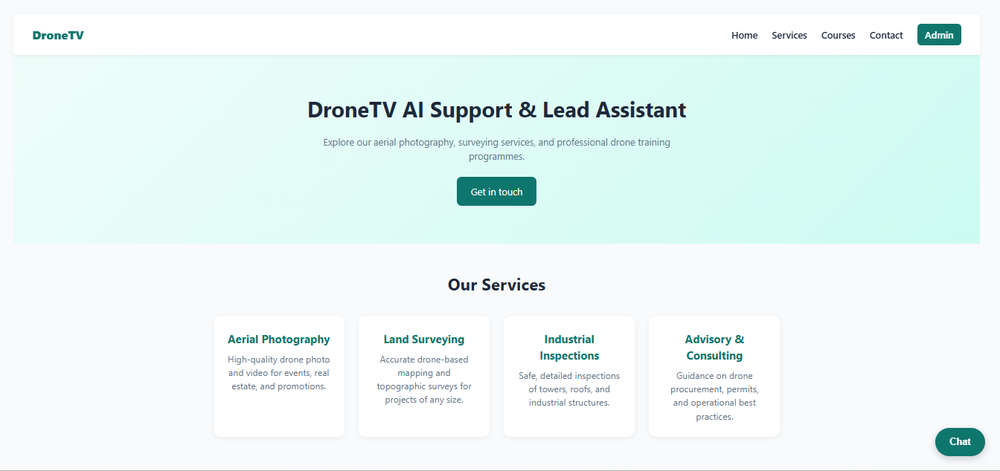
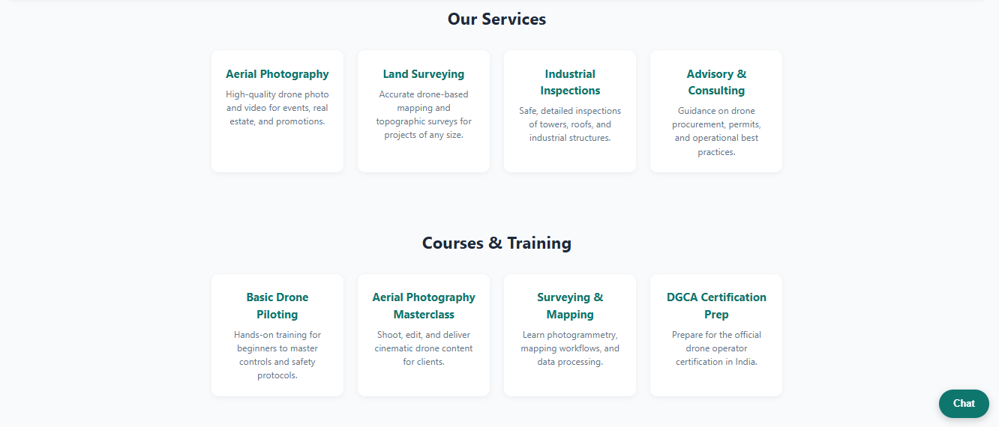
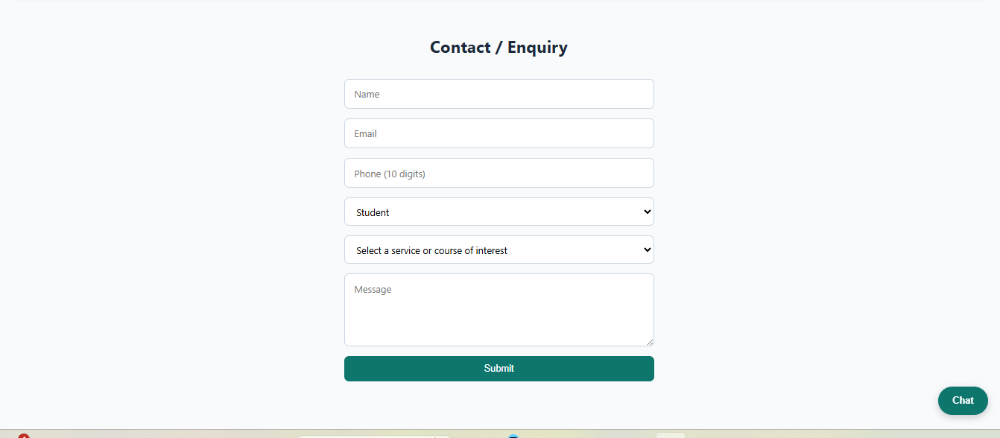
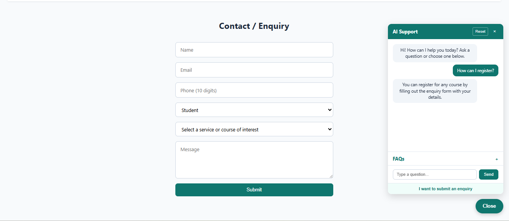
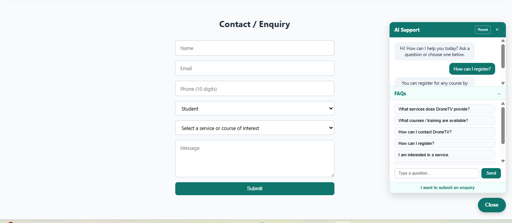
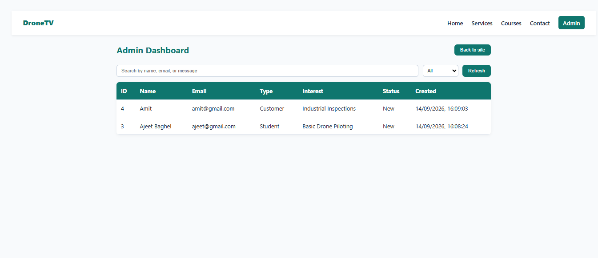
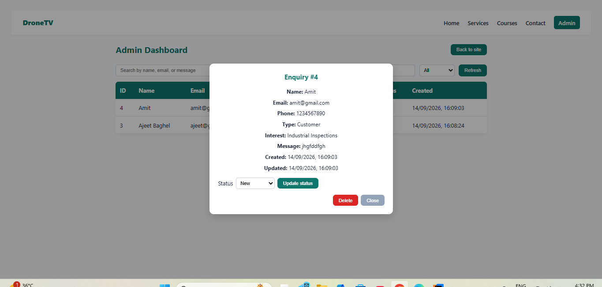

# DroneTV AI Support & Lead Assistant

Full Stack Developer Internship technical assignment for IPAGE Group.

## Project Description
A responsive web application for DroneTV featuring an AI support chatbot, customer/student enquiry capture, a REST API, PostgreSQL persistence, and an admin dashboard.

## Features
- Landing / Home page
- Services and Courses sections
- Contact / Enquiry form
- Rule-based AI chatbot with conversation history
- Predefined question/answer support with fallback
- Lead collection with validation
- Full CRUD REST API
- Admin dashboard with search, filter, status update, and delete
- Responsive design for desktop, tablet, and mobile

## Technologies Used
- React 18
- TypeScript
- Vite
- CSS
- Node.js
- Express
- PostgreSQL (`pg`)
- Git / GitHub

## Project Structure

```
FullStack_Chatbot_Task_Ajeet_Baghel/
├── client/
│   ├── src/components/       # Public pages, chatbot, forms, and admin UI
│   ├── package.json
│   └── vite.config.ts        # Development API proxy
├── server/
│   ├── src/routes/           # Enquiry CRUD routes
│   ├── src/db.ts             # PostgreSQL connection pool
│   ├── src/index.ts          # Express application entry point
│   ├── src/schema.sql        # Database schema
│   ├── .env.example
│   └── package.json
├── README.md
└── .gitignore
```

## Prerequisites

- Node.js 18 or later
- npm
- PostgreSQL
- Git

## Local Setup

1. Clone and enter the repository:

   ```bash
   git clone https://github.com/Ajeet-Baghel/FullStack_Chatbot_Task_Ajeet_Baghel.git
   cd FullStack_Chatbot_Task_Ajeet_Baghel
   ```

2. Install dependencies:

   ```bash
   cd client
   npm install
   cd ../server
   npm install
   ```

3. Copy `server/.env.example` to `server/.env` and enter your PostgreSQL credentials.

4. Create the configured PostgreSQL database and apply the schema:

   ```bash
   psql -U postgres -d dronetv -f src/schema.sql
   ```

5. Start the backend from `server/`:

   ```bash
   npm run dev
   ```

6. In another terminal, start the frontend from `client/`:

   ```bash
   npm run dev
   ```

7. Open `http://localhost:5173`. The development server proxies `/api` requests to `http://localhost:5000`.

## Environment Variables

Server `server/.env`:

```env
PORT=5000
PGUSER=postgres
PGHOST=localhost
PGDATABASE=dronetv
PGPASSWORD=your_password
PGPORT=5432
```

Never commit `server/.env` or real credentials.

## API Endpoints

| Method | Endpoint | Purpose |
|---|---|---|
| GET | `/api/enquiries` | Get all enquiries |
| GET | `/api/enquiries/:id` | Get single enquiry |
| POST | `/api/enquiries` | Create new enquiry |
| PUT | `/api/enquiries/:id` | Update enquiry |
| DELETE | `/api/enquiries/:id` | Delete an enquiry |
| GET | `/api/health` | Check API and database health |

### Enquiry Payload

```json
{
  "name": "Example User",
  "email": "user@example.com",
  "phone": "9876543210",
  "user_type": "Student",
  "interest": "Basic Drone Piloting",
  "message": "Please share the next batch details."
}
```

Allowed user types are `Student`, `Customer`, and `Other`. Enquiry statuses are `New`, `Contacted`, `In Progress`, and `Closed`.

## Available Scripts

### Client

- `npm run dev` — start the Vite development server
- `npm run build` — type-check and create a production build
- `npm run lint` — run TypeScript validation without output
- `npm run preview` — preview the production build

### Server

- `npm run dev` — start the TypeScript server in watch mode
- `npm run build` — compile TypeScript into `dist/`
- `npm start` — run the compiled production server

## Screenshots

### Landing Page



### Services and Courses



### Contact Form



### Chatbot Conversation



### Chatbot FAQs



### Admin Dashboard



### Admin Enquiry Details



## Production Deployment

A suggested setup is Vercel for `client/`, Render for `server/`, and managed PostgreSQL through Render or Neon.

Before deploying:

1. Replace relative frontend API calls or configure hosting rewrites so `/api` reaches the deployed backend.
2. Restrict Express CORS to the deployed frontend origin.
3. Enable SSL in the PostgreSQL pool when required by the database provider.
4. Apply `server/src/schema.sql` to the production database.
5. Configure server environment variables in the hosting dashboard.
6. Build the client with `npm run build` and the server with `npm run build`.
7. Verify `/api/health`, enquiry submission, listing, status updates, and deletion.

## Security Note

The current admin password check is client-side and is suitable only for demonstration. Before a public production deployment, replace it with server-side authentication, an HTTP-only session cookie, a hashed password, and authorization middleware for enquiry read/update/delete endpoints.

## Video Walkthrough

Walkthrough and submission notes are provided in `docs/WALKTHROUGH.md`.

## Live Demo

Not deployed yet. Add the public frontend and backend URLs here after deployment.

## Repository

https://github.com/Ajeet-Baghel/FullStack_Chatbot_Task_Ajeet_Baghel
